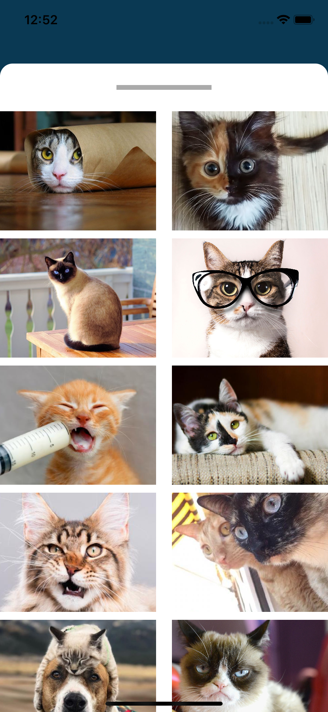
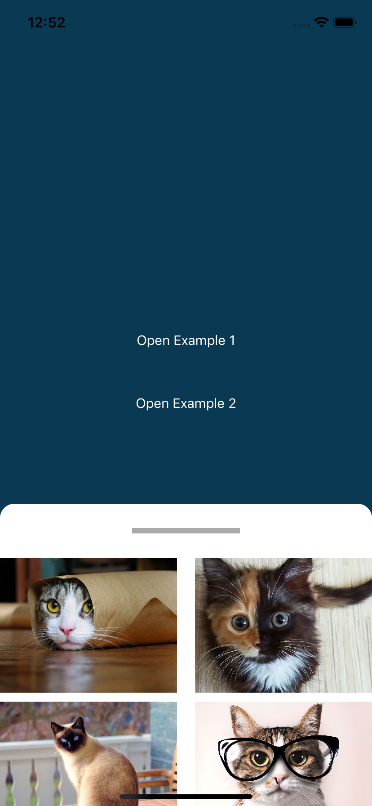

# InteractiveModal in Swift

Use the Core/InteractiveModal in just few seconds by creating a ViewController that extends from it.

Currently you can find some controller examples under the dir /Examples and the core controller in /Core.

##### Usage

Just create your custom controller, inherit from InteractiveModel and your controller content will be shown as a interactive modal, where you can swipe up or down and dismiss the view when you want by swipping down fast.

You can now start coding your app! 🍻🍻
